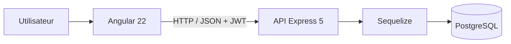

# EventHub


EventHub est une application full-stack de gestion et de réservation d’événements. Elle propose un espace public pour consulter les événements, un espace personnel pour gérer ses réservations et une administration complète pour piloter les catégories, les événements et leurs participants.

Ce projet met notamment en pratique une API REST sécurisée par JWT, les formulaires réactifs Angular, les règles d’intégrité métier et les transactions Sequelize.

## Fonctionnalités

### Visiteur et utilisateur

- inscription et connexion ;
- consultation de l’agenda et du détail des événements ;
- filtres par événements à venir et places disponibles ;
- affichage dynamique du taux de remplissage ;
- création, modification et annulation d’une réservation ;
- consultation de ses propres réservations.

### Administration

- CRUD des catégories et des événements ;
- protection des routes par rôle ;
- consultation des participants et de l’historique des réservations ;
- statistiques globales et taux de remplissage par événement ;
- suppression en cascade des réservations lors de la suppression d’un événement.

### Règles métier et sécurité

- mots de passe hachés avec `bcrypt` ;
- authentification par JSON Web Token ;
- autorisations `user` et `admin` vérifiées par le backend ;
- guards Angular et intercepteur HTTP ;
- nettoyage automatique des sessions expirées ;
- contrôle de propriété des réservations ;
- impossibilité de réserver, modifier ou annuler après le début d’un événement ;
- calcul des places occupées à partir des réservations confirmées ;
- transactions et verrouillage pour prévenir la surréservation concurrente.

## Architecture



```text
EventHub/
├── Backend/
│   └── src/
│       ├── config/       # Connexion et synchronisation PostgreSQL
│       ├── controllers/  # Validation et traitements HTTP
│       ├── middlewares/  # Authentification et autorisation
│       ├── models/       # Modèles et associations Sequelize
│       ├── routes/       # Routes de l’API REST
│       └── services/     # Calculs métier partagés
└── Frontend/
    └── src/app/
        ├── core/         # Modèles, services, guards et intercepteur
        ├── features/     # Authentification, événements, réservations, admin
        └── shared/       # Navigation et pages partagées
```

## Technologies

| Frontend | Backend | Données et outils |
| --- | --- | --- |
| Angular 22 | Node.js | PostgreSQL |
| TypeScript | Express 5 | Sequelize 6 |
| Reactive Forms | JWT | Prettier |
| Signals Angular | bcrypt | Postman |
| SCSS responsive | CORS | npm |

## Installation locale

### Prérequis

- Node.js et npm ;
- PostgreSQL ;
- un utilisateur PostgreSQL autorisé à créer et utiliser la base du projet.

### 1. Base de données

```sql
CREATE USER reservation_app WITH PASSWORD 'votre_mot_de_passe';
CREATE DATABASE reservation_evenements OWNER reservation_app;
```

### 2. Backend

Depuis un terminal CMD :

```bat
cd Backend
npm install
copy .env.example .env
```

Compléter `Backend/.env` à partir des valeurs de `.env.example`, puis exécuter :

```bat
npm run db:sync
npm run dev
```

L’API est disponible sur `http://localhost:3000`. Sa santé peut être contrôlée avec `GET /api/health`.

### 3. Frontend

Dans un second terminal CMD :

```bat
cd Frontend
npm install
npm start
```

Ouvrir ensuite `http://localhost:4200`.

### 4. Accès administrateur

L’inscription publique attribue volontairement le rôle `user`. Pour un environnement local, inscrire un compte, puis lui attribuer le rôle administrateur dans PostgreSQL :

```sql
UPDATE utilisateurs
SET role = 'admin'
WHERE email = 'admin@example.com';
```

## Principaux endpoints

| Méthode | Endpoint | Accès | Description |
| --- | --- | --- | --- |
| `POST` | `/api/auth/register` | Public | Inscription |
| `POST` | `/api/auth/login` | Public | Connexion et création du JWT |
| `GET` | `/api/events` | Public | Liste des événements et disponibilités |
| `GET` | `/api/events/:id` | Public | Détail d’un événement |
| `POST` | `/api/events` | Admin | Création d’un événement |
| `PUT` | `/api/events/:id` | Admin | Modification d’un événement |
| `DELETE` | `/api/events/:id` | Admin | Suppression d’un événement |
| `GET` | `/api/events/:id/reservations` | Admin | Participants d’un événement |
| `GET` | `/api/categories` | Authentifié | Liste des catégories |
| `POST / PUT / DELETE` | `/api/categories` | Admin | Gestion des catégories |
| `GET` | `/api/reservations` | Authentifié | Réservations du compte connecté |
| `POST` | `/api/reservations` | Authentifié | Création d’une réservation |
| `PUT` | `/api/reservations/:id` | Propriétaire | Modification du nombre de places |
| `PATCH` | `/api/reservations/:id/cancel` | Propriétaire | Annulation d’une réservation |

## Qualité du code

```bat
cd Backend
npm run format:check

cd ..\Frontend
npx prettier --check src\app
npm run build
```

Les principaux parcours ont aussi été validés manuellement avec Postman et les outils de développement du navigateur.

## Améliorations possibles

- tests automatisés unitaires, d’intégration et end-to-end ;
- test de charge sur les réservations concurrentes ;
- archivage des événements et des catégories ;
- renouvellement des JWT avec refresh token ;
- conteneurisation Docker et déploiement continu.

## Auteur

Projet full-stack réalisé par **Mike DJA** dans le cadre d’une validation des acquis en développement web.
